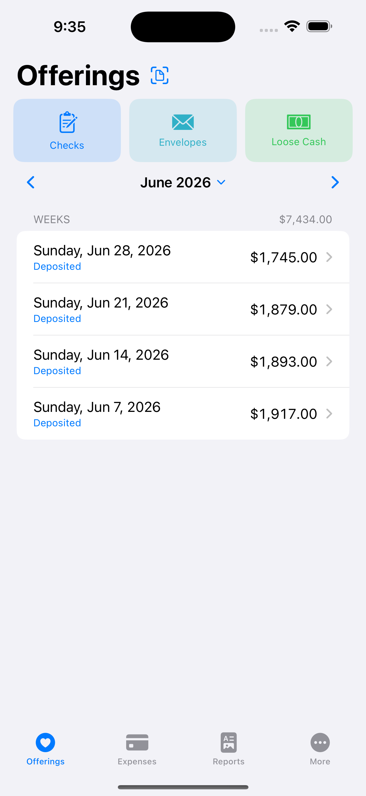
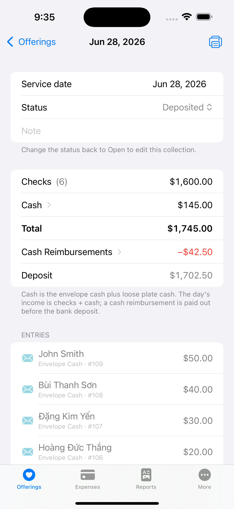
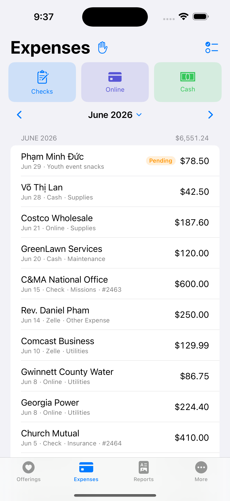
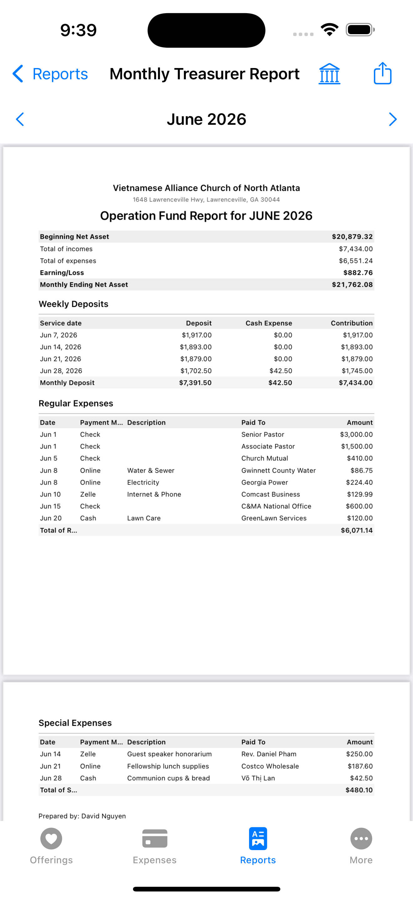
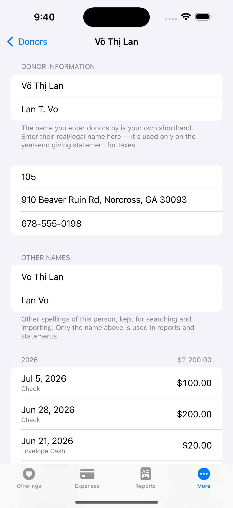
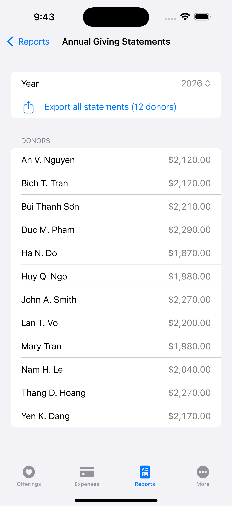

# Church Treasury

**Everything a church treasurer needs — in one private, on-device iOS app.**

Record Sunday offerings, track expenses, reconcile the bank, and produce professional
monthly and year-end reports — bilingual (English / Tiếng Việt), with **all data kept
locally on the device**. No account, no server, no cloud.

<p align="left">
  
  
  
  
</p>

---

## Screenshots

| Offerings | A collection | Expenses |
|:--:|:--:|:--:|
|  |  |  |

| Monthly report (PDF) | Donor profile | Year-end giving statements |
|:--:|:--:|:--:|
|  |  |  |

---

## Features

### 💒 Offerings
- One-tap entry for **checks**, **envelope cash**, and **loose cash**, organized by service date.
- **Loose cash counted by denomination** — enter how many of each bill; totals add up automatically.
- Per-collection breakdown: checks, cash (envelope + plate), on-the-spot cash reimbursements, and the exact **bank deposit**.
- **Scan a paper weekly report or a check** with the camera (VisionKit + on-device Vision OCR) — always followed by an editable review before anything is saved.
- Collections lock once marked *Deposited*, with an optional bank-receipt photo for the audit trail.

### 💸 Expenses
- Fast entry by payment method (check / online / Zelle / cash), category, and payee.
- **Regular vs. special** expenses, with a **monthly checklist** of recurring bills so nothing is missed.
- **Reimbursement requests** tracked from *pending* → *paid*, with receipt photos.

### 🏦 Reconciliation
- Import the monthly **Chase bank statement (PDF)**, parsed on-device, then matched against recorded deposits and expenses — with a mandatory review screen and manual-entry fallback.

### 📊 Reports
- **Monthly Treasurer Report** — a polished Operation-Fund PDF (net-asset summary, weekly deposits, regular & special expenses).
- **Year-end giving statements** — per-donor tax receipts, ready to print or send.
- **Year in Review** presentation and a full **Annual Audit** packet with attached evidence.

### 👥 Donors
- Donor profiles with giving history, addresses, and **legal names for tax statements**.
- **Alias / diacritic-insensitive matching** so a variant spelling (or a Vietnamese name written without accents) resolves to the right person, plus duplicate-donor merging.

### 🔒 Private & bilingual
- **All data stays on the device**, under the app's `Documents/` folder (database + photos), so the whole thing can be handed off in one piece when the treasurer changes.
- Full **English / Vietnamese** localization, including built-in step-by-step help.

---

## Tech stack

- **SwiftUI + SwiftData** (iOS 18), **Swift 6** with complete strict concurrency.
- Money is stored as **`Int` cents** everywhere — never floating point — so totals match the bank exactly.
- **Pure, unit-tested** parser and matcher (Chase statement parsing, reconciliation) with no UI dependencies.
- PDF reports rendered with `UIGraphicsPDFRenderer`; text recognition via the modern **Vision** `RecognizeTextRequest` and **VisionKit** document scanning.
- Project generated with **[XcodeGen](https://github.com/yonaskolb/XcodeGen)** from [`project.yml`](project.yml).

---

## Getting started

Requirements: **Xcode 16+**, an **iOS 18** simulator or device, and [XcodeGen](https://github.com/yonaskolb/XcodeGen)
(`brew install xcodegen`).

```bash
git clone git@github.com:odthientho/ChurchTreasury.git
cd ChurchTreasury

# Generate the Xcode project (the .xcodeproj is intentionally not committed)
xcodegen generate      # or: ./setup.sh

open ChurchTreasury.xcodeproj
```

Then set your signing **Team** in *Signing & Capabilities* and build/run (`⌘R`).

### Running the tests

```bash
xcodebuild -project ChurchTreasury.xcodeproj -scheme ChurchTreasury \
  -destination 'platform=iOS Simulator,name=iPhone 16 Pro Max' test
```

### Demo data (optional)

For screenshots/demos, launch with a DEBUG-only flag to load a full sample dataset:

```bash
xcrun simctl launch booted com.odthientho.ChurchTreasury -seedMockData
```

Add `-showTouches` to display a tap indicator while recording a walkthrough. Neither flag
runs during a normal launch, and both are DEBUG-only.

---

## Project structure

```
ChurchTreasury/
├── project.yml              # XcodeGen project definition
├── setup.sh                 # xcodegen generate helper
├── ChurchTreasury/
│   ├── App/                 # App entry + tab shell
│   ├── Models/              # SwiftData @Model types
│   ├── Services/            # Chase parser, reconciliation, PDF/report builders, seeders
│   ├── Utilities/           # Money (Int cents), Date helpers
│   ├── Views/               # Offerings · Expenses · Reports · Donors · Settings · Security
│   └── Resources/           # Localizable.xcstrings (en/vi), Assets
├── ChurchTreasuryTests/     # Swift Testing unit tests
├── ChurchTreasuryUITests/   # XCUITest UI tests
└── Promo/                   # Demo scripts + README (rendered media not committed)
```

---

## Privacy

Church Treasury has **no account, no analytics, and no network back-end**. Every offering,
expense, donor, and report lives only on the device (and in whatever backups the owner
chooses). It is designed so a departing treasurer can hand the entire dataset to the next
one without depending on anyone's personal cloud account.

---

<sub>Built with SwiftUI + SwiftData. 🤖 Portions generated with <a href="https://claude.com/claude-code">Claude Code</a>.</sub>
